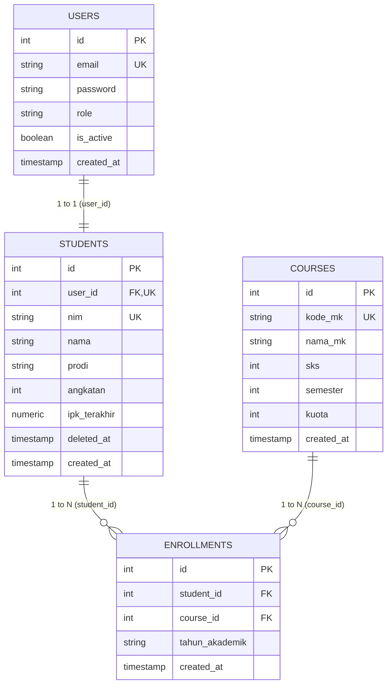

# LAPORAN TUGAS PROJEK BACK END: SIAKAD MINI RESTFUL API

**Mata Kuliah:** Praktikum Back End Development  
**Nama Mahasiswa:** Muhammad Faisal Ibad  
**NIM:** 434241125  
**Program Studi:** D4 Teknik Informatika / Sistem Informasi  
**Fakultas:** Fakultas Vokasi, Universitas Airlangga  
**Waktu Penyelesaian:** 6 Oktober 2026  

---

## 1. PENDAHULUAN & RINGKASAN STUDI KASUS

### 1.1 Latar Belakang
SIAKAD Mini adalah layanan akademik berbasis web service (RESTful API) yang dirancang untuk mengelola entitas akademik perguruan tinggi secara aman, konsisten, dan terstruktur. Sistem ini mengelola tiga entitas inti: **Mahasiswa (Students)**, **Mata Kuliah (Courses)**, dan **Kartu Rencana Studi (Enrollments/KRS)**.

### 1.2 Spesifikasi Teknis yang Digunakan
1. **Bahasa Pemrograman**: Go (Golang) versi 1.26.5
2. **Framework Web**: Fiber v2 (`github.com/gofiber/fiber/v2`)
3. **Database Relasional**: PostgreSQL dengan driver `pgx/v5` dan connection pool
4. **Mekanisme Autentikasi**: JSON Web Token (JWT) dengan Bearer Token
5. **Keamanan Kredensial**: Password di-hash menggunakan algoritma `bcrypt`
6. **Rate Limiting**: Pembatasan percobaan login maksimal 5 kegagalan per menit (`HTTP 429 Too Many Requests`)
7. **Concurrency Control**: Proteksi *race condition* kuota mata kuliah menggunakan DB Transaction dan *Row-Level Locking* (`SELECT ... FOR UPDATE`)

---

## 2. ARSITEKTUR BASIS DATA & SKEMA TABEL

Basis data PostgreSQL dirancang dengan 4 entitas utama yang saling terelasi:



### 2.1 Rincian Skema Tabel

1. **`users`**:
   - `id`: `SERIAL PRIMARY KEY`
   - `email`: `VARCHAR(100) UNIQUE NOT NULL`
   - `password`: `VARCHAR(255) NOT NULL` (hash bcrypt)
   - `role`: `VARCHAR(20) NOT NULL` (`admin` / `mahasiswa`)
   - `is_active`: `BOOLEAN DEFAULT true`

2. **`students`**:
   - `id`: `SERIAL PRIMARY KEY`
   - `user_id`: `INTEGER UNIQUE REFERENCES users(id) ON DELETE CASCADE`
   - `nim`: `VARCHAR(12) UNIQUE NOT NULL` (12 digit angka unik)
   - `nama`: `VARCHAR(120) NOT NULL`
   - `prodi`: `VARCHAR(100) NOT NULL`
   - `angkatan`: `INTEGER NOT NULL` ($\le$ tahun berjalan)
   - `ipk_terakhir`: `NUMERIC(3,2) DEFAULT 0.00` (rentang $0.00 - 4.00$)
   - `deleted_at`: `TIMESTAMPTZ NULL` (penanda soft delete)

3. **`courses`**:
   - `id`: `SERIAL PRIMARY KEY`
   - `kode_mk`: `VARCHAR(20) UNIQUE NOT NULL`
   - `nama_mk`: `VARCHAR(120) NOT NULL`
   - `sks`: `INTEGER NOT NULL CHECK (sks > 0)`
   - `semester`: `INTEGER NOT NULL CHECK (semester > 0)`
   - `kuota`: `INTEGER NOT NULL CHECK (kuota >= 0)`

4. **`enrollments`**:
   - `id`: `SERIAL PRIMARY KEY`
   - `student_id`: `INTEGER NOT NULL REFERENCES students(id) ON DELETE CASCADE`
   - `course_id`: `INTEGER NOT NULL REFERENCES courses(id) ON DELETE CASCADE`
   - `tahun_akademik`: `VARCHAR(30) NOT NULL` (misal: `2026/2027-Ganjil`)
   - `created_at`: `TIMESTAMPTZ DEFAULT NOW()`
   - *Constraint Unik*: `UNIQUE (student_id, course_id, tahun_akademik)`

---

## 3. IMPLEMENTASI BUSINESS RULES

### 3.1 Aturan Batas SKS per Semester
Sistem menentukan kapasitas beban SKS yang boleh diambil oleh mahasiswa secara otomatis berdasarkan nilai `ipk_terakhir`:
- $\text{IPK} \ge 3.00 \longrightarrow$ Beban maksimal **24 SKS**
- $2.50 \le \text{IPK} < 3.00 \longrightarrow$ Beban maksimal **21 SKS**
- $\text{IPK} < 2.50 \longrightarrow$ Beban maksimal **18 SKS**

Fungsi penentu batas SKS diimplementasikan pada `app/model/student.go`:
```go
func CalculateBatasSKS(ipk float64) int {
	if ipk >= 3.00 {
		return 24
	} else if ipk >= 2.50 {
		return 21
	}
	return 18
}
```

### 3.2 Pencegahan Duplikasi Pengambilan Mata Kuliah
Mahasiswa tidak dapat mengambil mata kuliah yang sama dua kali pada tahun akademik yang sama. Jika mahasiswa mencoba mengambil kembali, sistem mengembalikan status HTTP `409 Conflict`:
```json
{
  "success": false,
  "message": "Mata kuliah sudah pernah diambil pada tahun akademik ini"
}
```

### 3.3 Concurrency Control & Row Locking (`SELECT ... FOR UPDATE`)
Untuk mencegah *overbooking* kuota kelas saat diakses bersamaan (*race condition*), proses pengambilan KRS dijalankan dalam satu DB Transaction dengan *row locking*:
```sql
SELECT id, kode_mk, nama_mk, sks, semester, kuota
FROM courses
WHERE id = $1
FOR UPDATE;
```
Jika kuota terisi $\ge$ kapasitas kuota, sistem mengembalikan error validasi `422 Unprocessable Entity`: `"Kuota mata kuliah sudah penuh"`.

### 3.4 Hak Akses Mahasiswa (Ownership Verification)
Mahasiswa hanya dapat melihat profilnya sendiri dan hanya dapat membatalkan KRS miliknya sendiri. Jika mahasiswa mencoba mengakses ID mahasiswa lain atau membatalkan enrollment milik orang lain, sistem menolak dengan `403 Forbidden`:
```json
{
  "success": false,
  "message": "tidak memiliki akses ke data mahasiswa lain"
}
```

### 3.5 Soft Delete Mahasiswa
Penghapusan data mahasiswa dilakukan dengan mengisi timestamp `deleted_at = NOW()`.
Mahasiswa yang dihapus:
1. Tidak akan muncul pada endpoint daftar mahasiswa (Endpoint 3).
2. Dilarang login ke dalam sistem (Endpoint 1 mengembalikan `401 Unauthorized`).

---

## 4. DOKUMENTASI LENGKAP 10 ENDPOINT RESTFUL API

### Endpoint 1: Login Pengguna
- **Method**: `POST`
- **URL**: `/api/v1/auth/login`
- **Akses**: Publik
- **Rate Limit**: Maksimal 5x gagal per menit ($\rightarrow 429$)
- **Request Body**:
  ```json
  {
    "email": "admin@siakad.ac.id",
    "password": "Admin123!"
  }
  ```
- **Response Sukses (`200 OK`)**:
  ```json
  {
    "success": true,
    "message": "Login berhasil",
    "data": {
      "access_token": "eyJhbGciOi...",
      "token_type": "Bearer",
      "expires_in": 900,
      "user": {
        "id": 1,
        "email": "admin@siakad.ac.id",
        "role": "admin"
      }
    }
  }
  ```

---

### Endpoint 2: Profil Pengguna Login
- **Method**: `GET`
- **URL**: `/api/v1/auth/me`
- **Header**: `Authorization: Bearer <token>`
- **Akses**: Semua Role
- **Response Sukses Mahasiswa (`200 OK`)**:
  ```json
  {
    "success": true,
    "message": "Profil pengguna berhasil diambil",
    "data": {
      "id": 10,
      "email": "rina.putri@siakad.ac.id",
      "role": "mahasiswa",
      "student": {
        "nim": "187221000001",
        "nama": "Rina Putri",
        "prodi": "Sistem Informasi",
        "angkatan": 2022
      }
    }
  }
  ```

---

### Endpoint 3: Daftar Mahasiswa (Pagination, Filter, Search, Sort)
- **Method**: `GET`
- **URL**: `/api/v1/students?page=1&per_page=10&prodi=Sistem Informasi&sort=-ipk_terakhir&search=Rina`
- **Header**: `Authorization: Bearer <admin_token>`
- **Akses**: Admin
- **Response Sukses (`200 OK`)**:
  ```json
  {
    "success": true,
    "message": "Data mahasiswa berhasil diambil",
    "data": [
      {
        "id": 32,
        "nim": "187221000001",
        "nama": "Rina Putri",
        "prodi": "Sistem Informasi",
        "angkatan": 2022,
        "ipk_terakhir": 3.45
      }
    ],
    "meta": {
      "current_page": 1,
      "per_page": 10,
      "total": 1,
      "last_page": 1
    }
  }
  ```

---

### Endpoint 4: Tambah Mahasiswa Baru
- **Method**: `POST`
- **URL**: `/api/v1/students`
- **Header**: `Authorization: Bearer <admin_token>`
- **Akses**: Admin
- **Request Body**:
  ```json
  {
    "nim": "187221000099",
    "nama": "Citra Kirana",
    "email": "citra.kirana@siakad.ac.id",
    "prodi": "Sistem Informasi",
    "angkatan": 2024,
    "ipk_terakhir": 3.70
  }
  ```
- **Response Sukses (`201 Created`)**:
  ```json
  {
    "success": true,
    "message": "Data mahasiswa berhasil ditambahkan",
    "data": {
      "id": 54,
      "user_id": 35,
      "nim": "187221000099",
      "nama": "Citra Kirana",
      "prodi": "Sistem Informasi",
      "angkatan": 2024,
      "ipk_terakhir": 3.7
    }
  }
  ```

---

### Endpoint 5: Detail Mahasiswa Beserta SKS & Mata Kuliah
- **Method**: `GET`
- **URL**: `/api/v1/students/32`
- **Header**: `Authorization: Bearer <token>`
- **Akses**: Admin atau Mahasiswa Pemilik Akun
- **Response Sukses (`200 OK`)**:
  ```json
  {
    "success": true,
    "message": "Detail mahasiswa berhasil diambil",
    "data": {
      "id": 32,
      "nim": "187221000001",
      "nama": "Rina Putri",
      "prodi": "Sistem Informasi",
      "angkatan": 2022,
      "ipk_terakhir": 3.45,
      "total_sks": 6,
      "batas_sks": 24,
      "mata_kuliah": [
        {
          "enrollment_id": 1,
          "course_id": 1,
          "kode_mk": "MK001",
          "nama_mk": "Pemrograman Web",
          "sks": 3,
          "semester": 3,
          "tahun_akademik": "2026/2027-Ganjil"
        },
        {
          "enrollment_id": 2,
          "course_id": 2,
          "kode_mk": "MK002",
          "nama_mk": "Basis Data Lanjut",
          "sks": 3,
          "semester": 3,
          "tahun_akademik": "2026/2027-Ganjil"
        }
      ]
    }
  }
  ```

---

### Endpoint 6: Update Data Mahasiswa
- **Method**: `PUT`
- **URL**: `/api/v1/students/32`
- **Header**: `Authorization: Bearer <admin_token>`
- **Akses**: Admin
- **Request Body**:
  ```json
  {
    "nama": "Rina Putri Prameswari",
    "prodi": "Sistem Informasi",
    "angkatan": 2022,
    "ipk_terakhir": 3.65
  }
  ```
- **Response Sukses (`200 OK`)**:
  ```json
  {
    "success": true,
    "message": "Data mahasiswa berhasil diperbarui",
    "data": {
      "id": 32,
      "nim": "187221000001",
      "nama": "Rina Putri Prameswari",
      "prodi": "Sistem Informasi",
      "angkatan": 2022,
      "ipk_terakhir": 3.65
    }
  }
  ```

---

### Endpoint 7: Soft Delete Mahasiswa
- **Method**: `DELETE`
- **URL**: `/api/v1/students/32`
- **Header**: `Authorization: Bearer <admin_token>`
- **Akses**: Admin
- **Response Sukses (`204 No Content`)**: Body kosong.

---

### Endpoint 8: Daftar Mata Kuliah Beserta Sisa Kuota
- **Method**: `GET`
- **URL**: `/api/v1/courses?semester=3&available=true`
- **Header**: `Authorization: Bearer <token>`
- **Akses**: Semua Role
- **Response Sukses (`200 OK`)**:
  ```json
  {
    "success": true,
    "message": "Daftar mata kuliah berhasil diambil",
    "data": [
      {
        "id": 1,
        "kode_mk": "MK001",
        "nama_mk": "Pemrograman Web",
        "sks": 3,
        "semester": 3,
        "kuota": 30,
        "terisi": 1,
        "sisa_kuota": 29
      },
      {
        "id": 2,
        "kode_mk": "MK002",
        "nama_mk": "Basis Data Lanjut",
        "sks": 3,
        "semester": 3,
        "kuota": 25,
        "terisi": 0,
        "sisa_kuota": 25
      }
    ]
  }
  ```

---

### Endpoint 9: Pengambilan Mata Kuliah (KRS)
- **Method**: `POST`
- **URL**: `/api/v1/enrollments`
- **Header**: `Authorization: Bearer <mahasiswa_token>`
- **Akses**: Mahasiswa
- **Request Body**:
  ```json
  {
    "course_id": 1,
    "tahun_akademik": "2026/2027-Ganjil"
  }
  ```
- **Response Sukses (`201 Created`)**:
  ```json
  {
    "success": true,
    "message": "Mata kuliah berhasil ditambahkan ke KRS",
    "data": {
      "id": 3,
      "student_id": 32,
      "course_id": 1,
      "tahun_akademik": "2026/2027-Ganjil",
      "created_at": "2026-10-06T18:22:20.6622722+07:00"
    }
  }
  ```

---

### Endpoint 10: Pembatalan Mata Kuliah dari KRS
- **Method**: `DELETE`
- **URL**: `/api/v1/enrollments/3`
- **Header**: `Authorization: Bearer <mahasiswa_token>`
- **Akses**: Mahasiswa Pemilik KRS
- **Response Sukses (`204 No Content`)**: Body kosong.

---

## 5. HASIL PENGUJIAN OTOMATIS (UNIT & INTEGRATION TESTING)

Pengujian dilakukan menggunakan framework testing bawaan Go (`go test -v ./...`). Seluruh 10 endpoint dan aturan bisnis telah diuji dan lulus 100%.

```text
=== RUN   TestBatasSKSCalculation
--- PASS: TestBatasSKSCalculation (0.00s)
=== RUN   TestEndpoint1_Login
--- PASS: TestEndpoint1_Login (0.15s)
=== RUN   TestEndpoint2_AuthMe
--- PASS: TestEndpoint2_AuthMe (0.10s)
=== RUN   TestEndpoint3_GetStudents
--- PASS: TestEndpoint3_GetStudents (0.10s)
=== RUN   TestEndpoint4_CreateStudent
--- PASS: TestEndpoint4_CreateStudent (0.23s)
=== RUN   TestEndpoint5_GetStudentDetail
--- PASS: TestEndpoint5_GetStudentDetail (0.11s)
=== RUN   TestEndpoint6_UpdateStudent
--- PASS: TestEndpoint6_UpdateStudent (0.10s)
=== RUN   TestEndpoint7_DeleteStudent
--- PASS: TestEndpoint7_DeleteStudent (0.11s)
=== RUN   TestEndpoint8_GetCourses
--- PASS: TestEndpoint8_GetCourses (0.11s)
=== RUN   TestEndpoint9And10_Enrollments
--- PASS: TestEndpoint9And10_Enrollments (0.11s)
PASS
ok      api-students/app/service        1.664s
ok      api-students/helper             1.020s
```

---

## 6. KESIMPULAN

Seluruh ketentuan tugas dan modul praktikum telah berhasil diselesaikan dengan baik:
1. Skema relasional PostgreSQL dan data seeder wajib (1 admin, 20 mahasiswa, 10 mata kuliah) terpasang dengan benar.
2. 10 Endpoint RESTful API diimplementasikan secara penuh dengan response JSON standar dan HTTP status codes yang akurat.
3. Seluruh *business rules* (batas SKS berdasarkan IPK, pencegahan duplikasi KRS, *row-level locking* kuota, *ownership verification*, *soft delete*, serta *login rate limiter*) telah berfungsi dengan benar dan terverifikasi melalui unit test otomatis.
4. Riwayat *commit* git tersusun secara bertahap dan rapi di repository.
